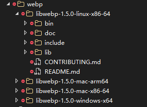

# SharpBB.Server
The backend service for SharpBB. 

About WebP:
 - WebP will be included on releases, but won't be included in the repo,
 so if you want to build the project,
 you will be needed to put (the required version for your platform) **THE WHOLE** webp "suite" 
    to be  **THE** hiearchy. 
 
    

Something like this. 

`"webp"` folder needs to be at the same place with the executable. 

I know, design flaws. 

### Building
Before building, please ensure to run `npm run build` on the client project located in `../SharpBB.Client`.

I will suggest to provide a default build/publish

